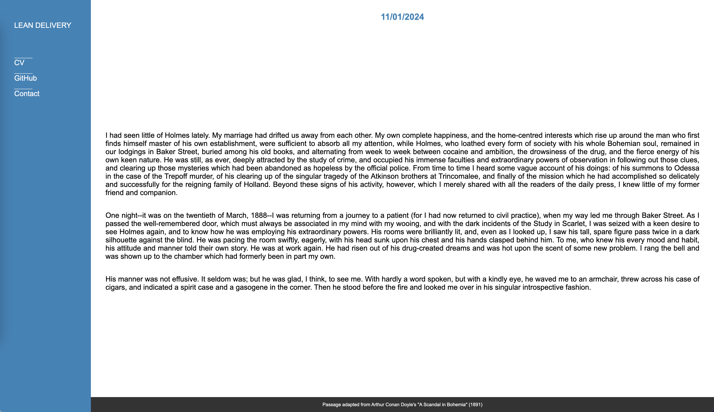

# Lean Delivery

> [!IMPORTANT]
> Before starting, please fork this repository into your own GitHub account.

## Front-End Assessment
Use the source code in `index.html` to create a well-formatted version of this simple website.

Refer to the attached screenshots for visual references of the desktop and mobile versions.

### Requirements
- Do not include any external dependencies; use only pure CSS and vanilla JS.
- Use semantic HTML so your tags convey meaning.
  Feel free to add, remove, or replace any tags in the page to achieve this.
  Change the structure of the HTML any way you like.
- Extend the provided styles to achieve the desired layout.
- Use JavaScript to replace {{name}} with your name and {{date}} with the current date in a nice format.
- Menu
  - Add links to your CV and GitHub profile in the menu.
    If you don't have a GitHub profile, just add a link to anywhere you like.
  - When someone clicks Contact, open a dialog/modal with your contact information displayed.

### Application
- When you're finished, send an email with the link to your finished project's GitHub Repo to jobs@lean.delivery. Include a brief explanation of why you would like to work for us and your salary expectation.

### Visual references

